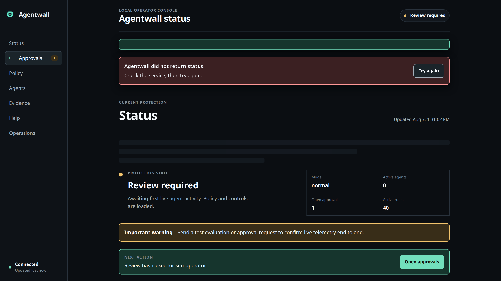
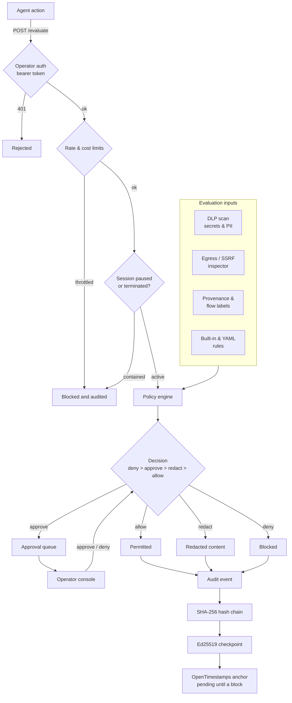

<p align="center"></p>

<h1 align="center">Agentwall</h1>

<p align="center"><strong>A runtime firewall for AI agents.</strong></p>

<p align="center">
It observes what agents actually do on the host, attributes each action to the process that took it,<br/>
and keeps a record that cannot be quietly rewritten.
</p>

<p align="center">
  <a href="https://github.com/repsecure/agentwall/actions/workflows/ci.yml"></a>
  <a href="LICENSE"></a>
  
  
  
</p>

---

An agent with credentials, a shell, and network access is asked to behave. Prompts are not a
security boundary: an agent that has been argued into exfiltrating a key still holds the key.
Agentwall works one layer down, where an action becomes real, and treats the agent as the
untrusted party rather than a collaborator.

It is for people running agents on machines they care about: an individual whose workstation
holds a dozen API keys, a small team sharing a build box, anyone operating a fleet of
autonomous jobs. It runs locally, needs no account, has no paid tier, and the operator console
is part of the tool.

<p align="center"></p>

## Read this before the feature list

Two properties matter more than anything below, and both are limits.

**It ships observing, not blocking.** Egress through the proxy is recorded and allowed. The
shipped entrypoint hard-codes the allow decision ([`src/index.ts:29`](src/index.ts)), so
monitor mode is not a default you might drift off, it is the only behaviour the proxy has
today. Blocking is a posture you move to deliberately, once your own ledger shows what your
agents legitimately reach. A firewall that starts by breaking your tooling gets switched off,
and a switched-off firewall protects nothing.

**Capture is cooperative, not enforced.** The proxy is found through standard proxy
environment variables. A process that ignores them egresses without being seen. This is
measurable, not theoretical: on Node 20+, `fetch` bypasses `https_proxy` unless
`NODE_USE_ENV_PROXY=1` is set, and a bypassing request produces zero ledger rows. Nothing in
this repository installs iptables or nftables redirection. Agentwall raises the cost of
unobserved egress; it does not make it impossible.

The rest of the limits are in [Limits](#limits). They are not footnotes.

## Quick start

Linux, Node.js 22.12 or newer. Verified on Node 24.14.1.

```bash
npm install -g @repsecure/agentwall

agentwall init --mode monitor
agentwall doctor
```

The npm package named `agentwall`, without a scope, is a different and unrelated project. This
one is `@repsecure/agentwall`; the command it installs is `agentwall`.

From a checkout instead:

```bash
git clone https://github.com/repsecure/agentwall.git
cd agentwall
npm install
npm run build

node dist/cli.js init --mode monitor
node dist/cli.js doctor
```

`init` writes `agentwall.config.yaml` and `policy.yaml` into the current directory. Both are
gitignored, so a fresh clone has neither and `init` will not overwrite work you already have.
`doctor` checks Node, the build output, and those two files.

Start it. Every value here is required for the thing it enables, so none of them are optional
noise:

```bash
export AGENTWALL_OPERATOR_TOKEN="$(openssl rand -hex 32)"   # without this, every route 401s
export AGENTWALL_AUDIT_FILE="$PWD/audit.jsonl"              # without this, the chain is stdout-only
export AGENTWALL_PROXY_PORT=8899                            # without this, the proxy does not start

node dist/cli.js start
```

Run commands through it, from a second shell in the same directory:

```bash
https_proxy=http://127.0.0.1:8899 curl -s -o /dev/null https://example.com/
https_proxy=http://127.0.0.1:8899 python3 -c "import urllib.request; urllib.request.urlopen('https://example.com/')"
NODE_USE_ENV_PROXY=1 https_proxy=http://127.0.0.1:8899 node -e "fetch('https://example.com/')"

tail -1 audit.jsonl
```

Each request appends a chained record naming the process that made it:

```json
{"agentId":"curl","plane":"network","action":"egress:https","decision":"allow",
 "reasons":["monitor-first: observed, not gated"],
 "metadata":{"host":"example.com","port":"443","pid":"1101858","comm":"curl",
             "durationMs":"378","bytesUp":"797","bytesDown":"5344"},
 "integrity":{"chainIndex":1,"hash":"0e86f943...","previousHash":"4678da51...",
              "algorithm":"sha256","status":"chained-local","canon":"cu1"}}
```

Ask for a policy decision. The token is mandatory; without it this returns `401`:

```bash
curl -s http://127.0.0.1:3000/evaluate \
  -H "authorization: Bearer $AGENTWALL_OPERATOR_TOKEN" \
  -H 'content-type: application/json' \
  -d '{"agentId":"demo","plane":"network","action":"http_get",
       "payload":{"url":"http://169.254.169.254/latest/meta-data/"},
       "flow":{"direction":"egress"}}'
```

```json
{"decision":"deny","riskLevel":"critical",
 "matchedRules":["net:block-ssrf-private","net:block-metadata-endpoint"],
 "reasons":["Request targets a private or local network address",
            "Request targets a cloud metadata endpoint"],
 "detections":[{"id":"det.net.ssrf.private","mitreAttack":{"techniqueId":"T1190"}},
               {"id":"det.net.metadata.access","mitreAttack":{"techniqueId":"T1552.005"}}]}
```

The operator console is at `http://127.0.0.1:3000/dashboard`. A browser cannot send a bearer
header, so for local use start with `AGENTWALL_ALLOW_LOOPBACK_DEV=1`, which accepts loopback
callers as a `loopback-dev` principal. Do not set it on a host reachable by anyone else.

## Checking the record yourself

An audit file is worth only as much as your ability to check it without trusting us. Two
verifiers ship in this repository, and the second one carries the argument.

The bundled TypeScript verifier recomputes each record's hash by calling `chainAuditEvent`, the
same function in [`src/audit/chain.ts`](src/audit/chain.ts) that wrote that hash
([`src/audit/anchor-service.ts:309-315`](src/audit/anchor-service.ts)). That makes it a useful
tamper check and no evidence at all about the format: a mistake in that function is made
identically when writing and when checking, and the comparison still passes. A verifier written
by the same people in the same language as the writer proves the code agrees with itself.

[`verifier/`](verifier/README.md) is a second program, in Go. It shares no code with the writer,
parses JSON with a different parser, verifies Ed25519 with a different cryptography stack, and
implements [docs/audit-format.md](docs/audit-format.md) rather than importing anything from `src/`.
That document is the only thing the two programs have in common, so when both accept a file, the
agreement is evidence about the FORMAT. Where they disagree one of them is wrong, and the
conformance harness fails on the disagreement rather than burying it.

Every command below runs against evidence committed to this repository, so it reproduces from a
bare checkout. Point `--audit` at your own file to check your own records; both CLI commands also
accept `AGENTWALL_AUDIT_FILE` in place of `--audit`.

### The bundled verifier

```bash
npm ci && npm run build
node dist/cli.js verify --audit verifier/testdata/corpus/g4-anchored-pending/audit.jsonl
```

```
PASS  chained   24 records across 4 segment(s)
            records link within each segment, so an edit inside one is detectable
PASS  linked    3 segment(s) linked, head 8759f6167246d827
            segments link and match their files, so removing or replacing one is detectable
PASS  anchored  0 confirmed, 1 pending a Bitcoin block
            a fingerprint exists off-box and still matches what is here, so a local rewrite shows

1 anchor(s) pending a Bitcoin block. Pending is not proof;
re-run verify once a block confirms.
```

`verify` reports three layers separately, because they fail independently and one combined verdict
would hide which guarantee you actually have. Exit status is 0 only when all three pass, and
`--json` gives the machine-readable form. Run the same command against corpus case
`b1-decision-flipped`, where one decision is flipped from deny to allow and the record's own hash is
left untouched: the `chained` layer then fails with
`line 2: hash mismatch, record altered after write`, names the file by absolute path, and the
command exits 1.

The `anchored` layer judges an anchor record by its evidence rather than by what the record says
about itself. It recomputes each record's digest from the checkpoint the record embeds
(`digest-mismatch`), requires non-empty proof bytes behind any submission that reached a calendar
(`proof-missing`), and parses that proof against the submitted digest (`proof-parse-error`). A
submission recorded with an error is exempt: it never reached a calendar, so it has no proof to
point at and is already counted as failed.

`anchored` fails until an anchor exists. `agentwall anchor` seals the live segment, signs an
Ed25519 checkpoint over the head, and submits its digest to OpenTimestamps, which needs network
access and no account:

```bash
cp -r verifier/testdata/corpus/g3-rotated-segments /tmp/aw-anchor-demo
node dist/cli.js anchor --audit /tmp/aw-anchor-demo/audit.jsonl
```

```
Anchored
  checkpoint index  3
  checkpoint hash   d8e5eac822f4d723eadc8c9a89c96597e282c22006c1d1d70437bd6a411556c3
  covers            24 records (3 sealed segment(s) + 6 live)
  calendar          https://alice.btc.calendar.opentimestamps.org/digest
  proof             /tmp/aw-anchor-demo/proofs/0475b7690ead3a875eadc85592210df784d775d405f042c9bee10d1dfab6a8bb.ots
  status            pending

OpenTimestamps anchors into a Bitcoin block, so this stays pending for roughly
one to six hours. It is not proof until a block confirms it.
```

The copy exists because anchoring writes a signing key, an anchor log, and a proof file beside the
audit file, and the corpus in git stays exactly as it was generated. The proof filename in your run
differs from the one above: the signing key is created on first use, so your checkpoint is signed
by a key that exists only on your machine.

### The independent verifier, from a bare checkout

Go 1.22 or newer, and nothing else. The Go module lives in `verifier/`, so these commands run from
that directory rather than from the repository root:

```bash
cd verifier
go build -o agentwall-verify .
./agentwall-verify --audit testdata/corpus/g4-anchored-pending/audit.jsonl
```

```
chained  PASS  24 records across 4 segment(s)
linked   PASS  3 segment(s) linked, head 8759f6167246d827...
anchored PASS  0 confirmed, 1 pending a Bitcoin block; pending at https://alice.btc.calendar.opentimestamps.org/timestamp
signatures are self-consistent; supply --pubkey to bind them to a key you expect
overall  PASS
```

`go run . --audit <path>` runs it without producing a binary, and prints one line of its own,
`exit status 1`, when the verifier exits nonzero.

Zero dependencies is a property you check rather than a claim you accept:

```bash
go list -m all
```

```
github.com/repsecure/agentwall/verifier
```

One line, and it is this module. SHA-256, Ed25519, SPKI parsing, and JSON all come from the Go
standard library, which is why the verifier is written in Go: a program whose whole job is being
trustworthy should not ask you to trust a supply chain first.

### Pin the key, or a checkpoint signature is decoration

This is the honest core of the anchored layer. Corpus case `b8-checkpoint-foreign-key` is the good
case with its checkpoint re-signed by a different key, and it is internally consistent: the
signature verifies against the public key the checkpoint carries. Unpinned, it passes.

```bash
./agentwall-verify --audit testdata/corpus/b8-checkpoint-foreign-key/audit.jsonl; echo "exit $?"
```

```
chained  PASS  24 records across 4 segment(s)
linked   PASS  3 segment(s) linked, head 8759f6167246d827...
anchored PASS  0 confirmed, 1 pending a Bitcoin block; pending at https://alice.btc.calendar.opentimestamps.org/timestamp
signatures are self-consistent; supply --pubkey to bind them to a key you expect
overall  PASS
exit 0
```

The line above the verdict is the verifier naming what it did not check. A self-signed checkpoint
proves nothing until you pin the key, because anyone who can rewrite the log can sign the rewrite
with a key they generated. Pin the key you expect and the same bytes fail:

```bash
./agentwall-verify --audit testdata/corpus/b8-checkpoint-foreign-key/audit.jsonl \
                   --pubkey-file testdata/corpus/b8-checkpoint-foreign-key/pubkey.txt; echo "exit $?"
```

```
chained  PASS  24 records across 4 segment(s)
linked   PASS  3 segment(s) linked, head 8759f6167246d827...
anchored FAIL  0 confirmed, 1 pending a Bitcoin block; pending at https://alice.btc.calendar.opentimestamps.org/timestamp
    - checkpoint-key-mismatch: anchor 1: checkpoint public key does not match the pinned key
overall  FAIL
exit 1
```

The pin discriminates rather than refusing everything. The same pin against the honest case passes,
because every checkpoint in the corpus except `b8`'s is signed by the key `pubkey.txt` names:

```bash
./agentwall-verify --audit testdata/corpus/g4-anchored-pending/audit.jsonl \
                   --pubkey-file testdata/corpus/b8-checkpoint-foreign-key/pubkey.txt; echo "exit $?"
```

```
chained  PASS  24 records across 4 segment(s)
linked   PASS  3 segment(s) linked, head 8759f6167246d827...
anchored PASS  0 confirmed, 1 pending a Bitcoin block; pending at https://alice.btc.calendar.opentimestamps.org/timestamp
overall  PASS
exit 0
```

`--pubkey <base64-spki>` takes the key inline, `--pubkey-file <path>` reads base64 or PEM. The pin
is worth what its source is worth: a key you recorded elsewhere when it was created is worth more
than one read out of the directory that holds the evidence. The bundled verifier has no pin flag.
It compares each checkpoint against the public half of the signing key file beside the audit log
([`src/audit/anchor-service.ts:421-433`](src/audit/anchor-service.ts)), which is the writer's own
key rather than one you chose.

### The conformance corpus

`verifier/testdata/corpus/` holds one directory per case, each with an `expected.json` naming the
exit code and the three layer verdicts the format requires. Good cases are written by the
production writers in `src/audit`, so the corpus cannot drift into a private idea of the format.
Forgeries are byte edits applied on top of a case that passed, and they are internally consistent
on purpose, so catching one takes a property the forger cannot recompute:

- `b2-record-removed-tail-relinked` removes a record, then relinks and rehashes the entire tail.
  Every `previousHash` in the file is correct. The chain index sequence is what exposes it.
- `b15-sealed-segment-rewritten` rewrites a sealed segment end to end and relinks it internally.
  The manifest entry bound to that segment's bytes is what exposes it.
- `b16-live-tail-rewritten-after-checkpoint` rewrites the last live record after the checkpoint was
  signed. The live tail that checkpoint committed to is what exposes it, and re-committing to the
  rewrite needs the signing key.
- `b8-checkpoint-foreign-key` re-signs the checkpoint consistently under another key. Only a pin
  supplied from outside the evidence exposes it.
- `b17-sealed-segment-missing` deletes a sealed segment file and leaves the manifest naming it. Both
  verifiers report `segment-missing` on the `linked` layer, which is the layer that made the claim.
- `b4-index-reuse-concurrent-writers` appends a second writer's records under indexes already used.
  Both verifiers fail the `chained` layer with an index gap and a broken link, and the message names
  a gap, restart, or reused index, because that shape is what two processes appending to one chain
  look like rather than one altered record. The single-writer lock exists to prevent it.

Two limit cases pin what the format does not bind, so neither limit can be quietly forgotten.
`l1-confirmed-with-pending-proof` passes: an anchor claiming `confirmed` whose proof carries only a
pending attestation is accepted, because nothing compares the status claim against the attestations
in the proof. `l2-legacy-canon-unmarked` fails with `hash-mismatch-or-legacy-canon`, because records
hashed under the pre-marker key order cannot be recomputed by a verifier that does not carry ICU
collation tables, and reporting them as unverifiable is a different statement from reporting them as
tampered.

Run both verifiers over every case:

```bash
npm run build
cd verifier && go build -o agentwall-verify . && cd ..
node scripts/conformance.js
```

The run prints one line per case. Its tail:

```
ok         b9-anchor-digest-altered  exit=1 chained=true linked=true anchored=false
ok         b10-proof-truncated  exit=1 chained=true linked=true anchored=false
ok         b11-torn-tail  exit=1 chained=true linked=true anchored=false
ok         b12-duplicate-key-shadowed  exit=1 chained=false linked=true anchored=false
ok         b13-confirmed-without-proof  exit=1 chained=true linked=true anchored=false
ok         b14-submission-never-reached-calendar  exit=1 chained=true linked=true anchored=false
ok         b15-sealed-segment-rewritten  exit=1 chained=true linked=false anchored=true
ok         b16-live-tail-rewritten-after-checkpoint  exit=1 chained=true linked=true anchored=false
ok         b17-sealed-segment-missing  exit=1 chained=true linked=false anchored=true
ok         l1-confirmed-with-pending-proof  exit=0 chained=true linked=true anchored=true
ok         l2-legacy-canon-unmarked  exit=1 chained=false linked=true anchored=false

26 cases, typescript and go: 26 agreed, 0 declared divergence(s), 0 failure(s)
```

Each case is copied to a temp directory before it runs, so a verifier cannot alter what it checks.
Regeneration is deterministic, which is what makes an unexpected diff mean something:

```bash
npm run gen:corpus && git status --porcelain verifier/testdata
```

That prints nothing, because the regenerated tree is byte identical to the committed one.

Both verifiers return the same verdict on every case, which is why the summary declares no
divergences. That is agreement across the 26 cases the corpus contains, not a proof that the two
implementations are equivalent: a forgery nobody has written a case for has been put to neither of
them. The harness fails the run if they ever stop agreeing on a case it does contain
([`scripts/conformance.js:40-50`](scripts/conformance.js)).

### What verification does not prove

- **Completeness.** An anchor shows that what was written was not altered afterwards. It cannot
  show that everything which should have been written was. A decision that was never recorded
  leaves nothing to detect, and no verifier finds it.
- **A correct specification.** Two readers of the same wrong document agree with each other and are
  both wrong, so independence catches implementation bugs and shared runtime assumptions, not a
  format mistake. The document is [docs/audit-format.md](docs/audit-format.md), which is why it is
  written at the byte level and kept short enough to read in one sitting.
- **Inclusion in a Bitcoin block, while an anchor is pending.** Pending means a calendar accepted a
  submission. Both verifiers report pending as pending, and the Go verifier reports a Bitcoin
  attestation as a block height plus the derived value for you to compare against that block's
  merkle root, which it does not fetch.

To run the tests behind the claims in this file:

```bash
npx jest tests/audit-chain.test.ts tests/audit-signing.test.ts tests/audit-anchor.test.ts \
         tests/operator-auth.test.ts tests/route-auth.test.ts tests/ssrf.test.ts tests/policy.test.ts
npm run lint     # tsc --noEmit
npm test         # full suite
cd verifier && go test ./...
```

## What it does

### Sees egress, and knows which process caused it

A CONNECT-aware forward proxy ([`src/proxy/forward-proxy.ts`](src/proxy/forward-proxy.ts))
captures egress from any client honouring proxy environment variables. Verified with `curl`,
`python3`, `bun`, and `node` (the last needs `NODE_USE_ENV_PROXY=1`).

Identity is observed, not self-reported. Agentwall maps the client socket back to its owning
process through `/proc/net/tcp` inode matching and `/proc/<pid>/fd`, so a record carries the
real `pid` and `comm` even when the agent framework cooperates in no way at all and even if it
lies about who it is.

The cost scales with how many processes and descriptors the host has, so treat these as shape
rather than a constant. Resolving a socket for a process not seen recently walks all of
`/proc`; a recently-seen process is checked directly from a 16-entry cache. Measured on a
430-process host: 19.7 ms cold, 0.48 ms warm (medians). On a busier machine the same walk
measured roughly 44 ms cold and 1.6 ms warm, recorded at
[`src/proxy/forward-proxy.ts:60-71`](src/proxy/forward-proxy.ts). For HTTPS the walk happens
after the tunnel is established, off the connection's critical path. Attribution failure
degrades to `pid: null` and never blocks egress.

One quirk worth knowing: a process name comes from `/proc/<pid>/comm`, which is the thread
name, not the binary. Node reports `MainThread`, so Node egress is attributed to `MainThread`
rather than `node`.

### Decides, with precedence you can predict

The policy engine ([`src/policy/engine.ts`](src/policy/engine.ts)) scores an action across six
planes (`network`, `tool`, `content`, `browser`, `identity`, `governance`) and returns one of
`allow`, `redact`, `approve`, `deny`. Every matching rule contributes; the most restrictive
wins, ordered `deny` > `approve` > `redact` > `allow`
([`src/policy/engine.ts:12-16`](src/policy/engine.ts)). Results carry matched rule IDs, plain
reasons, a risk level, and detections mapped to MITRE ATT&CK technique IDs, so an operator and
an audit record agree on why something happened.

The engine's built-in default is `deny` ([`src/config.ts:150`](src/config.ts)), as is egress
default-deny ([`src/config.ts:158`](src/config.ts)). `init --mode guarded` and `--mode strict`
both write that. `init --mode monitor` deliberately writes `allow` instead, because the point
of monitor mode is to learn your real traffic without breaking it. Check which you have before
assuming you are protected:

```bash
grep -A1 defaultDecision agentwall.config.yaml
```

Policy is a built-in rule pack plus hot-reloadable YAML. A file that fails to parse is
rejected whole and the previous ruleset stays in force
([`src/policy/runtime.ts:66-77`](src/policy/runtime.ts)), so a typo cannot leave you running
with half a policy or none.

Also present: DLP detectors with inline redaction (AWS keys, GitHub PATs and OAuth tokens,
OpenAI keys, Slack tokens, private keys, JWTs, SSNs, credit cards, emails, phone numbers);
SSRF and egress inspection with scheme, port, and host allowlists that block private,
loopback, and link-local ranges plus cloud metadata endpoints; shell command preflight; a
persistent approval queue with `auto`/`always`/`never` modes; per-session and per-actor rate
limits, pending-approval caps, and cost budgets; manifest drift detection against approved
fingerprints; and session pause, resume, and terminate enforced on `/evaluate`.

### Keeps a record that resists rewriting

Audit events are SHA-256 hash-chained, each record naming its predecessor
([`src/audit/chain.ts`](src/audit/chain.ts)). Edit one and every later link breaks. The
integrity status a record carries is `chained-local`, deliberately not `verified`, because
linking at write time is not evidence that anything checked it.

Three properties make the file survive real operation rather than only a demo:

- **Single-writer lock.** An `O_EXCL` lock file holds the writer's pid. A second writer starts
  only if the first is provably unable to append, and "I could not tell" is not proof: an
  unverifiable live owner refuses the takeover with an explanation
  ([`src/audit/file-sink.ts:121-174`](src/audit/file-sink.ts)). Two processes appending would
  interleave two chains into one file and destroy the property the log exists for.
- **Torn-tail recovery.** A crash mid-append leaves a partial record. On restart Agentwall
  resumes from the last intact one and reports what it dropped
  (`resumed from the last intact record; discarded 1 torn record(s) at the tail`).
- **Restart-safe resume.** A restart continues the existing chain rather than starting a new
  one, logging `audit chain resumed from prior run`. A genuine discontinuity is reported as
  one instead of being silently absorbed.

`agentwall anchor` seals the segment, signs an Ed25519 checkpoint over the head, and submits
the digest to OpenTimestamps, which batches it into a Merkle tree whose root lands in a
Bitcoin transaction. No account and no API key. The calendar's response is the proof and is
persisted, since discarding it would reduce the anchor to a claim that an HTTP request once
happened.

Why bother, given the chain and the signature already exist: neither survives an adversary who
owns the host. Anyone who can write the file can recompute the chain, and anyone who can read
the signing key can re-sign it. Every purely local control has that ceiling. An anchor breaks
it by putting a fingerprint somewhere this machine cannot reach back into, so rewriting history
requires altering a record held by someone the operator does not control. The reasoning is
kept next to the code in [`src/audit/signing.ts:12-37`](src/audit/signing.ts) and
[`src/audit/anchor.ts:6-46`](src/audit/anchor.ts).

### Refuses unauthenticated callers

Operator auth ([`src/auth/operator.ts`](src/auth/operator.ts)) is a bearer token compared in
constant time, registered as a global `onRequest` hook on an allowlist model: everything is
protected unless explicitly public, so a route added next year is guarded by default rather
than open until someone remembers. Only `/health` and `/api/health` are public.

It fails closed. With no token configured and loopback-dev off, every other route returns
`401` and the server logs why, loudly, because a service that silently refuses everything is
worse than one that explains itself. A wrong token is an explicit failure that does not fall
through to the loopback path.

## Limits

Stated plainly, because a security tool that oversells itself is worse than no tool.

| Limit | What it means |
| --- | --- |
| Monitor-first, no blocking | The proxy records and allows. `decide` is hard-coded to `allow` at [`src/index.ts:29`](src/index.ts). Enforcement is a posture you build toward, not something you get by installing this. |
| Cooperative capture | Proxy environment variables are honoured voluntarily. A process that ignores them egresses unobserved. No iptables or nftables redirection is installed. |
| Anchoring is pending, not instant | An OpenTimestamps anchor stays `pending` until a Bitcoin block confirms, roughly one to six hours. `verify` reports pending as pending. Pending is not proof. |
| Anchoring proves no alteration, not completeness | An anchor shows that what was written was not altered afterwards. It cannot show that everything which should have been written was. Silent omission at write time is a different, unsolved problem. |
| A signature is necessary, not sufficient | It proves a key holder vouched. On a host where the audited principal can read the key, an agent with root can sign anything the operator can. Off-box anchoring is what closes that gap. |
| Verifier agreement is bounded by the corpus | The bundled TypeScript verifier and the independent Go verifier return the same verdict on all 26 conformance cases. That is agreement about the cases the corpus contains, not a proof that the two implementations are equivalent, and it says nothing about a forgery neither has been asked to judge. The harness fails if they ever stop agreeing on a case the corpus does contain. |
| No TLS interception | CONNECT traffic is visible at hostname and port level only. Request paths, headers, and bodies stay opaque. This is deliberate: MITM would need a CA in every runtime trust store, which breaks the framework-agnostic property the proxy exists for. |
| Attribution is Linux-only | It reads `/proc/net/tcp` and `/proc/<pid>/fd`. There is no macOS or Windows equivalent here. The rest of the server is portable; process attribution is not. |
| Channel containment is Telegram only | Slack and Discord appear in the platform schema ([`src/integrations/communication-channel/control.ts:5`](src/integrations/communication-channel/control.ts)) with no route implementation behind them. |
| The watchdog does not auto-deny | It evaluates heartbeat age and exposes a kill-switch flag, and a rule denies on the `watchdog_timeout` flow label ([`src/policy/rules.ts:394`](src/policy/rules.ts)), but nothing wires staleness to that label automatically. Treat it as a signal you act on, not an automatic containment. |
| Telemetry is off by default | The OTLP/HTTP JSON decision-trace exporter is hand-rolled over Node `http`/`https` with no OpenTelemetry SDK dependency, and is disabled unless configured ([`src/config.ts:136`](src/config.ts)). |
| Bearer tokens, not identity | A shared token, not OIDC or mTLS. There is no identity-provider integration. |
| Single host | Multiple instances can be polled into one summary view. There is no clustered or highly-available control plane. |

## API

Every route except `/health` and `/api/health` requires `Authorization: Bearer <token>`.

```text
POST /evaluate                                          # policy decision
POST /inspect/content                                   # DLP secret and PII scan, redaction
POST /inspect/network                                   # egress and SSRF inspection
POST /inspect/manifest                                  # manifest drift detection
POST /approval/request    GET /approval/pending         # approval queue
POST /approval/:requestId/respond
POST /integrations/communication-channel/guardrail      # channel containment
POST /integrations/damage-control/command-preflight     # shell command preflight
GET  /detections          GET /rules                    # detection catalog, active rules
GET  /api/dashboard/state GET /api/dashboard/events      # operator console state, SSE stream
GET  /api/org/summary                                   # multi-instance summary
GET  /health              GET /ready                    # liveness; /ready needs the token
```

## Configuration

Config resolution order: `--config <path>`, `$AGENTWALL_CONFIG`, `./agentwall.config.yaml`,
`./agentwall.config.yml`, `./examples/config.yaml`
([`src/config.ts:179-187`](src/config.ts)). Paths inside the config are relative to the working
directory, so run Agentwall from the directory you ran `init` in.

| Variable | Effect |
| --- | --- |
| `AGENTWALL_OPERATOR_TOKEN` | Bearer token for every non-public route. Unset means everything returns `401`. |
| `AGENTWALL_ALLOW_LOOPBACK_DEV` | `1` accepts loopback callers without a token. Local development only. |
| `AGENTWALL_AUDIT_FILE` | Path for the hash-chained audit log. No default, by design: a security product should not invent a location in `$HOME`. Unset means stdout only. |
| `AGENTWALL_PROXY_PORT` | Forward proxy port. Unset or `0` means the proxy does not start. |
| `AGENTWALL_PROXY_HOST` | Proxy bind host. Defaults to `127.0.0.1`. |
| `AGENTWALL_PROXY_LEDGER` | Flat JSONL view of destinations, for allowlist analysis. No default, same reason as the audit file. Unset means no flat ledger; the audit chain is still the record. |
| `AGENTWALL_AGENT_HOME` | Directory the dashboard probes for an agent behaviour contract. Defaults to `~/.agentwall/agent`. |
| `AGENTWALL_TELEGRAM_TEST_BOT_TOKEN` | Bot token for the Telegram containment routes. Unset disables them. |
| `AGENTWALL_TELEGRAM_TEST_WEBHOOK_SECRET` | Shared secret Telegram must present on the webhook. |
| `AGENTWALL_TELEGRAM_TEST_AGENT_ID` | Agent id recorded for messages arriving on that webhook. |
| `AGENTWALL_TELEGRAM_TEST_SEND_ENABLED` | `1` permits outbound sends. Default is receive-only. |
| `AGENTWALL_CONFIG` | Explicit config path. |

## Architecture

Request to decision to audit, for a single agent action:



Egress observed by the proxy enters the same hash chain, attributed to the originating process
([`src/index.ts:27-83`](src/index.ts)).

## Built with

TypeScript 5 (strict) on Node.js 22.12+, Fastify 5, Zod, YAML policy via `js-yaml`, Jest.
Runtime dependencies are deliberately three: `fastify`, `js-yaml`, `zod`. Logging is Fastify's
own pino instance, which arrives as its dependency rather than ours. The audit and anchoring
paths use Node's own `crypto` and plain HTTP with no third-party clients, because a dependency
inside the component whose entire job is being trustworthy is a supply-chain risk this project
declines.

## Docs

[Threat model](docs/threat-model.md) - [Architecture](docs/architecture.md) -
[Install](docs/install.md) - [Tutorials](docs/tutorials/README.md) -
[Changelog](CHANGELOG.md)

## Contributing

Issues and pull requests are welcome, including ones that show a claim in this file is wrong.
See [CONTRIBUTING.md](CONTRIBUTING.md), [GOVERNANCE.md](GOVERNANCE.md), and
[CODE_OF_CONDUCT.md](CODE_OF_CONDUCT.md). Security reports go through
[SECURITY.md](SECURITY.md), not a public issue.

## License

Apache-2.0. See [LICENSE](LICENSE) and [NOTICE](NOTICE).
